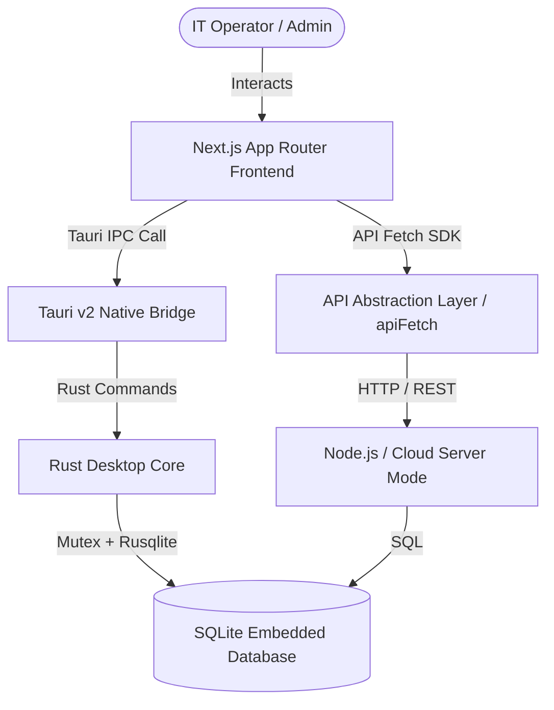
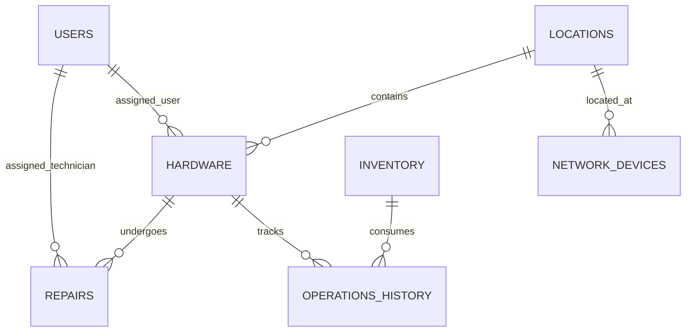

# Pulse IT Operations Platform — Enterprise System Documentation

## 1. System Overview & Architecture

Pulse is an enterprise-grade IT Operations & Asset Management platform built with a high-performance desktop-first architecture. It combines native desktop speed and offline capability with modern web UI standards.

### High-Level Architecture Diagram



### Key Architectural Pillars

- **Hybrid Platform Target**: Operates seamlessly as both a standalone **Tauri v2 Desktop Application** and a **Web Application**.
- **Static Export Compatibility**: Next.js configured with `output: 'export'` generating 100% pre-rendered static assets loaded into WebView2.
- **Embedded Database**: Local SQLite database managed via Rust (`rusqlite` with `Mutex` thread-safety) for instant startup and zero external database latency.
- **Lazy Loading & Tree Shaking**: Dynamic imports (`next/dynamic`) for heavy analytical components (`Recharts`, `NetworkTopology`, `jspdf`).

---

## 2. Database Architecture & Schema

The database utilizes SQLite configured with enterprise performance pragmas:

```sql
PRAGMA journal_mode = WAL;
PRAGMA synchronous = NORMAL;
PRAGMA mmap_size = 3000000000; -- 3GB memory mapped I/O
PRAGMA cache_size = -64000;    -- 64MB memory page cache
PRAGMA foreign_keys = ON;
```

### Entity Relationship Diagram (ERD)



### Table Definitions & Constraints

#### `users`

| Column | Type | Constraints | Description |
| :--- | :--- | :--- | :--- |
| `id` | TEXT | PRIMARY KEY | Unique user identifier |
| `username` | TEXT | UNIQUE, NOT NULL | Account login handle |
| `email` | TEXT | UNIQUE, NOT NULL | Primary communication email |
| `password_hash` | TEXT | NOT NULL | Bcrypt hashed credentials |
| `role` | TEXT | NOT NULL | RBAC role (`ADMIN`, `MANAGER`, `TECHNICIAN`, `VIEWER`) |
| `created_at` | TEXT | DEFAULT CURRENT_TIMESTAMP | Account creation timestamp |

#### `locations`

| Column | Type | Constraints | Description |
| :--- | :--- | :--- | :--- |
| `id` | TEXT | PRIMARY KEY | Site/Room identifier |
| `name` | TEXT | NOT NULL | Location name (e.g. Server Room 4B) |
| `type` | TEXT | NOT NULL | Type (`Data Center`, `Office`, `Warehouse`, `Remote`) |
| `parent_id` | TEXT | FOREIGN KEY(locations.id) | Parent location for nested hierarchy |

#### `hardware` (Assets)

| Column | Type | Constraints | Description |
| :--- | :--- | :--- | :--- |
| `id` | TEXT | PRIMARY KEY | Unique Asset ID |
| `asset_tag` | TEXT | UNIQUE, NOT NULL | Barcode / Inventory tag |
| `name` | TEXT | NOT NULL | Device descriptor |
| `category` | TEXT | NOT NULL | `Laptop`, `Server`, `Switch`, `Workstation`, `Mobile` |
| `status` | TEXT | NOT NULL | `Deployed`, `In Stock`, `In Repair`, `Retired` |
| `make` | TEXT | NOT NULL | Manufacturer (e.g. Dell, Cisco, Apple) |
| `model` | TEXT | NOT NULL | Model designation |
| `serial_number` | TEXT | UNIQUE | Manufacturer serial number |
| `location_id` | TEXT | FOREIGN KEY(locations.id) | Current physical location |
| `assigned_user_id` | TEXT | FOREIGN KEY(users.id) | Assigned employee |

#### `inventory` (Consumables & Parts)

| Column | Type | Constraints | Description |
| :--- | :--- | :--- | :--- |
| `id` | TEXT | PRIMARY KEY | SKU/Item ID |
| `sku` | TEXT | UNIQUE, NOT NULL | Stock keeping unit |
| `name` | TEXT | NOT NULL | Consumable name |
| `category` | TEXT | NOT NULL | `Cable`, `RAM`, `Storage`, `Peripheral`, `Tool` |
| `quantity` | INTEGER | NOT NULL DEFAULT 0 | Current stock level |
| `min_quantity` | INTEGER | NOT NULL DEFAULT 5 | Low stock alert threshold |

#### `network_devices`

| Column | Type | Constraints | Description |
| :--- | :--- | :--- | :--- |
| `id` | TEXT | PRIMARY KEY | Network device ID |
| `ip_address` | TEXT | UNIQUE, NOT NULL | IPv4 / IPv6 address |
| `mac_address` | TEXT | UNIQUE, NOT NULL | Hardware MAC address |
| `hostname` | TEXT | | Resolved DNS / NetBIOS hostname |
| `status` | TEXT | NOT NULL | `Online`, `Offline`, `Degraded` |
| `switch_port` | TEXT | | Connected switch port mapping |
| `location_id` | TEXT | FOREIGN KEY(locations.id) | Site location |

#### Database Triggers

- **`network_device_insert_trigger`**: Automatically logs new network device discoveries to `operations_history`.
- **`asset_status_audit_trigger`**: Records status transitions in the asset audit log whenever `hardware.status` is updated.

---

## 3. API Reference & IPC Layer

The frontend uses `apiFetch` in `src/lib/api.ts` which routes calls via REST API or Tauri Native IPC transparently depending on execution environment.

### Primary Endpoint / IPC Methods

```typescript
// Assets API
export const assetsApi = {
  getAll: () => Promise<Asset[]>,
  getOne: (id: string) => Promise<Asset>,
  create: (data: Partial<Asset>) => Promise<Asset>,
  update: (id: string, data: Partial<Asset>) => Promise<Asset>,
  remove: (id: string) => Promise<void>,
  reassign: (id: string, userId: string) => Promise<void>,
  retire: (id: string, reason: string) => Promise<void>,
};

// Network Operations API
export const networkApi = {
  getDevices: () => Promise<NetworkDevice[]>,
  scanRange: (subnet: string) => Promise<ScanResult>,
  getAlerts: () => Promise<NetworkAlert[]>,
};

// Help Desk API
export const ticketsApi = {
  getAll: () => Promise<Ticket[]>,
  getOne: (id: string) => Promise<Ticket>,
  create: (ticket: Partial<Ticket>) => Promise<Ticket>,
  updateStatus: (id: string, status: string) => Promise<Ticket>,
};
```

---

## 4. Authentication

Pulse provides dual-mode authentication:
1. **Desktop Direct Auth**: Authenticates directly against the embedded SQLite database using Rust `bcrypt` verification.
2. **Web API Token Auth**: Issues JWT tokens stored securely in `sessionStorage` / `localStorage`.

### Auth Flow Components
- **`AuthProvider.tsx`**: React context provider managing user session state (`user`, `login`, `logout`, `isAuthenticated`).
- **`SetupGuard.tsx`**: Route guard checking if the initial admin user exists; redirects to `/setup` if system configuration is pending.

---

## 5. Permissions & RBAC Matrix

| Feature Module | ADMIN | MANAGER | TECHNICIAN | VIEWER |
| :--- | :---: | :---: | :---: | :---: |
| **View Dashboard & Assets** | Read/Write | Read/Write | Read | Read |
| **Create / Retire Hardware** | Full | Full | Read | Read |
| **Inventory Adjustment** | Full | Full | Write | Read |
| **Network Discovery Scan** | Full | Full | Execute | Read |
| **Helpdesk Ticket Status** | Full | Full | Write | Read |
| **System Settings & Backups**| Full | None | None | None |

---

## 6. Modules Guide

- **Dashboard**: Core operational metrics, system health indices, live inventory stock alerts, and real-time event feeds.
- **Assets**: Complete hardware lifecycle management (Procured -> Deployed -> Maintenance -> Retired).
- **Inventory**: Consumable parts tracking, automated low-stock warnings, reorder recommendations.
- **Network**: Interactive visual topology map, switch port mapping, IP subnet scanner, downtime alert monitoring.
- **Locations**: Site tree hierarchy visualizer and equipment allocation counts per building/room.
- **Employee Directory**: Hardware assigned per staff member, checkout activity, contact directory.
- **Repairs & Maintenance**: Service tickets, repair cost logging, technician assignment workflows.
- **Help Desk**: Ticket queuing, priority sorting, inline detail panels.
- **Knowledge Base / SOPs**: Markdown technical documentation editor and searchable knowledge repository.
- **Reports**: Analytical report generation with chart visualization and PDF/CSV data exports.

---

## 7. Component Architecture

```
src/
├── app/                  # Next.js App Router pages
│   ├── assets/           # Assets management page
│   ├── helpdesk/         # Helpdesk & ticket management
│   ├── inventory/        # Stock & consumables
│   ├── network/          # Network topology & scanning
│   ├── reports/          # Report generation & exports
│   └── settings/         # Admin & system config
├── components/           # Reusable UI components
│   ├── assets/           # Asset Modals, Forms, Timelines
│   ├── dashboard/        # Activity feeds & metric cards
│   ├── layout/           # Header, Sidebar, GlobalSearch, AI Assistant
│   ├── network/          # Network Topology (Lazy Loaded)
│   └── reports/          # Report Charts (Lazy Loaded)
├── lib/                  # Core SDK, API, & Utilities
│   ├── api.ts            # API abstraction layer
│   ├── core/             # Module plugin registry
│   └── reportExport.ts   # PDF & CSV generator utilities
```

---

## 8. Deployment & Packaging

### Desktop Application (Tauri v2)
Building the production desktop installer:

```bash
npm run tauri build
```
This produces native binaries in `src-tauri/target/release/bundle/`:
- **Windows**: `.msi` and `.exe` installers via NSIS.

### Web Server / Container (Docker)
Build and run via Docker:

```bash
docker build -t pulse-web .
docker run -p 3000:3000 pulse-web
```

---

## 9. Configuration Files

- `next.config.ts`: Configured with `output: 'export'`, `optimizePackageImports` for tree-shaking `lucide-react`, `recharts`, and `framer-motion`.
- `src-tauri/Cargo.toml`: Package configuration with `default-run = "pulse"`.
- `eslint.config.mjs`: ESLint v9 flat config with `globalIgnores`.

---

## 10. Environment Variables

Create `.env.production.local` for custom deployments:

| Variable | Default Value | Description |
| :--- | :--- | :--- |
| `NEXT_PUBLIC_API_URL` | `/api` | Base URL for REST API calls |
| `DATABASE_URL` | `./pulse.db` | SQLite database file location |
| `NODE_ENV` | `production` | Deployment environment mode |

---

## 11. Installation Guide

### Prerequisites
- Node.js `v18.0.0` or higher
- Rust `1.75+` (for desktop build)
- C++ Build Tools for Visual Studio (Windows desktop build)

### Step-by-Step Installation

1. **Clone repository & install dependencies**:
   ```bash
   npm install
   ```

2. **Run Desktop App in Development Mode**:
   ```bash
   npm run tauri dev
   ```

3. **Run Web Version in Development Mode**:
   ```bash
   npm run dev
   ```

---

## 12. Maintenance & Administration

### Database Maintenance
Execute routine SQLite maintenance to ensure optimal database speed:

```sql
-- Re-index all tables for search performance
REINDEX;

-- Compress & defragment database file
VACUUM;

-- Verify database integrity
PRAGMA integrity_check;
```

---

## 13. Troubleshooting Guide

| Issue | Root Cause | Solution |
| :--- | :--- | :--- |
| `cargo run error 101` | Multiple Rust binaries detected | Ensure `default-run = "pulse"` is present in `src-tauri/Cargo.toml` |
| Next.js Static Export Error | Dynamic `[id]` route in `app/` | Convert dynamic route to query-based inline panel or supply `generateStaticParams()` |
| Database Lock Error | Concurrent write locks in SQLite | Ensure WAL mode is active (`PRAGMA journal_mode = WAL`) |

---

## 14. Developer Guide

### Code Style & Standards
- Enforce strict TypeScript typing (`noImplicitAny: true`).
- Prefer modular components in `src/components/` over monolithic page logic.
- Run `npm run lint` and `npm run test` before creating pull requests.

### Running Tests
```bash
# Run unit tests
npm run test

# Run End-to-End Playwright smoke tests
npm run test:e2e
```

---

## 15. Administrator Guide

1. Log into the system using primary Administrator credentials during first startup (`/setup`).
2. Navigate to **Settings -> User Management** to create technician and operator accounts.
3. Configure physical sites under **Locations** before importing hardware assets.
4. Set up Network Scan Subnets under **Network -> Settings** for automated device discovery.

---

## 16. User Guide

- **Creating an Asset**: Navigate to **Assets**, click **+ Add Asset**, enter tag, serial number, location, and assignee.
- **Reporting a Hardware Issue**: Navigate to **Help Desk**, click **New Ticket**, select the hardware asset, enter defect description, and set priority.
- **Generating Reports**: Navigate to **Reports**, select the desired dataset (Assets, Maintenance, Inventory), click **Export PDF** or **Export CSV**.
