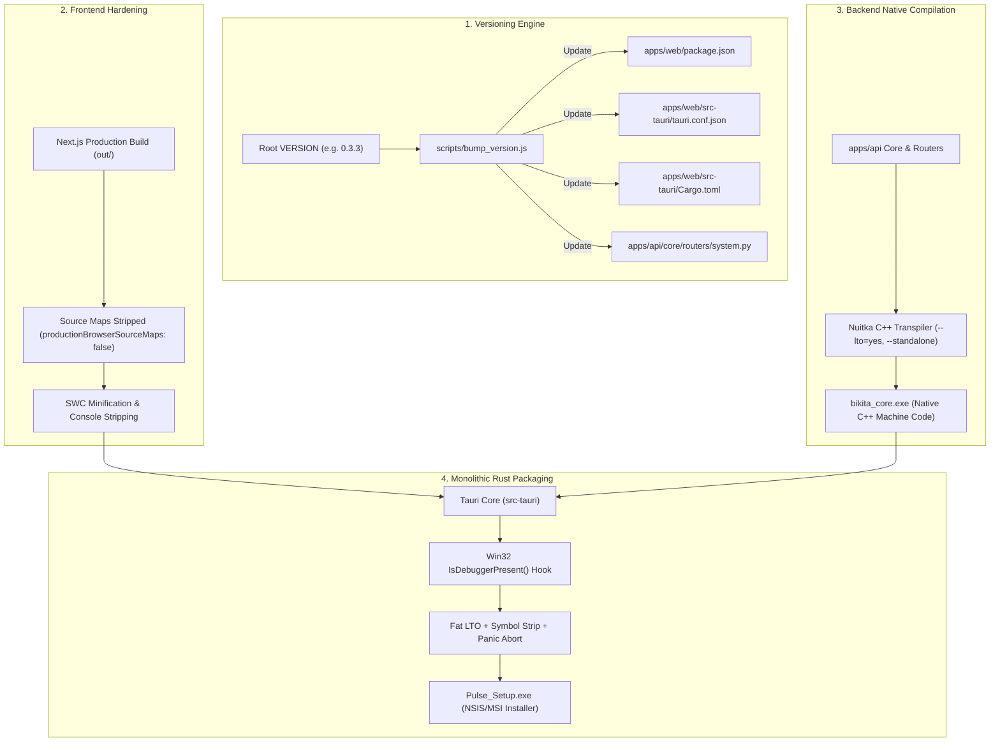

# Design Specification: Anti-Reverse Engineering, Binary Hardening & Unified Versioning

**Date:** 2026-08-18  
**Status:** Approved by User via `/grill-me`  
**Target Systems:** Backend (`apps/api`), Frontend (`apps/web`), Desktop Installer (`apps/web/src-tauri`), Root Version Engine (`VERSION`, `scripts/bump_version.js`)

---

## 1. System Goals & Protection Matrix

1. **Zero-Bytecode Backend Immunity**:
   - Compile Python/Django into native C++ machine-code binaries (`bikita_core.exe`) using **Nuitka**.
   - Strip all `.py` source and `.pyc` files from distribution packages so standard decompilers (`uncompyle6`, `pycdc`, `decompyle++`) fail completely.

2. **Single-Source Semantic Versioning (SemVer)**:
   - Root `VERSION` file acts as the single source of truth for the entire ecosystem.
   - CLI command `npm run bump:patch`, `npm run bump:minor`, `npm run bump:major` automatically updates:
     - `VERSION`
     - `apps/web/package.json`
     - `apps/web/src-tauri/tauri.conf.json`
     - `apps/web/src-tauri/Cargo.toml`
     - `apps/api/core/routers/system.py` (`GET /api/system/version`)
     - Build-time Git commit SHA-256 and compile timestamps.

3. **Frontend Bundle Hardening & Binary Embedding**:
   - 100% removal of `.map` source map files in production.
   - SWC aggressive minification, symbol mangling, and `console.log` stripping.
   - Web assets are baked directly into the Tauri Rust executable `resources` table (zero loose HTML/JS files in the installation directory).

4. **Monolithic Binary Hardening & Runtime Anti-Debugging**:
   - Rust release profile: `opt-level = 3`, `lto = "fat"`, `codegen-units = 1`, `panic = "abort"`, `strip = "symbols"`.
   - Startup Win32 `IsDebuggerPresent()` check terminating the process if attached to debuggers or memory injectors.

---

## 2. Technical Architecture & Build Pipeline



---

## 3. Detailed Component Specifications

### 1. Semantic Versioning Script ([`scripts/bump_version.js`](file:///c:/Users/armut/404/BikitaIT/scripts/bump_version.js))
- Reads current version from `VERSION`.
- Computes next SemVer (`patch`, `minor`, `major`).
- Synchronously updates `package.json`, `tauri.conf.json`, `Cargo.toml`, and creates/updates `apps/api/core/version.py`.
- Generates `GET /api/system/version` returning:
  ```json
  {
    "version": "0.3.3",
    "git_commit": "a1b2c3d...",
    "build_timestamp": "2026-08-18T17:45:00Z",
    "environment": "production"
  }
  ```

### 2. Rust Cargo Hardening ([`apps/web/src-tauri/Cargo.toml`](file:///c:/Users/armut/404/BikitaIT/apps/web/src-tauri/Cargo.toml))
```toml
[profile.release]
opt-level = 3
lto = "fat"
codegen-units = 1
panic = "abort"
strip = "symbols"
incremental = false
```

### 3. Anti-Debug Hook in Rust Entrypoint ([`apps/web/src-tauri/src/main.rs`](file:///c:/Users/armut/404/BikitaIT/apps/web/src-tauri/src/main.rs))
```rust
#[cfg(target_os = "windows")]
fn enforce_anti_debug() {
    use windows_sys::Win32::System::Diagnostics::Debug::IsDebuggerPresent;
    unsafe {
        if IsDebuggerPresent() != 0 {
            std::process::exit(0x1337);
        }
    }
}
```

### 4. Next.js Production Hardening ([`apps/web/next.config.ts`](file:///c:/Users/armut/404/BikitaIT/apps/web/next.config.ts))
```typescript
const nextConfig = {
  productionBrowserSourceMaps: false,
  compiler: {
    removeConsole: process.env.NODE_ENV === 'production' ? { exclude: ['error'] } : false,
  },
};
```

---

## 4. Verification & Testing Plan

1. **Versioning Engine Verification**:
   - Run `node scripts/bump_version.js patch` and verify all target files update cleanly.
   - Verify `GET /api/system/version` matches `VERSION`.
2. **Frontend Build Verification**:
   - Run `npm --prefix apps/web run build`.
   - Verify no `.map` files are generated in `apps/web/out/`.
3. **Backend Native Compilation Script Verification**:
   - Verify `scripts/build_protected.ps1` builds without error.
