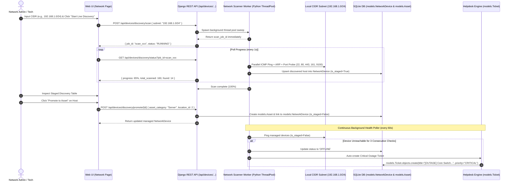

# Design Specification: Live Background Network Scanner & Real-Time Health Polling Engine

**Date:** 2026-08-18  
**Status:** Approved by User via `/grill-me`  
**Target Modules:** `apps/api/core/network_scanner.py`, `apps/api/core/routers/network.py`, `apps/web/src/app/network/page.tsx`, `apps/web/src/components/network/*`

---

## 1. System Goals & Requirements

1. **Native Asynchronous Network Scanner**:
   - Background multi-threaded subnet sweep (`ThreadPoolExecutor` + asynchronous TCP/ICMP probing) with live scan progress (`GET /api/devices/discovery/status`).
   - Zero external message broker dependencies (runs natively within Python/Django).

2. **Multi-Protocol Device Fingerprinting**:
   - **ICMP Ping & TCP Syn/Ack**: Measure round-trip latency (ms) and host availability.
   - **ARP & MAC OUI Resolution**: Extract hardware MAC address and identify manufacturer (e.g. Cisco, Apple, Dell, HP, Ubiquiti, Epson).
   - **DNS & NetBIOS Name Resolution**: Automatically resolve internal hostnames (`printer-floor2.local`, `sw-core-01`).
   - **Targeted Port Probing**: Probe signature ports (`22` SSH, `80` HTTP, `443` HTTPS, `161` SNMP, `445` SMB, `9100` JetDirect Printer, `8080` Web GUI) to classify device type into:
     - `SWITCH`, `ROUTER`, `ACCESS_POINT`, `SERVER`, `PRINTER`, `WORKSTATION`, `GENERIC_IOT`.

3. **Continuous Background Health Polling & Automated Outage Response**:
   - Background polling worker checks latency and health for all managed network devices.
   - State degradation rules:
     - `1 missed poll` -> `DEGRADED` (Warning state, marked yellow in topology).
     - `3 consecutive missed polls` -> `OFFLINE` (Critical state, marked red).
   - **Automated Helpdesk Incident Generation**: When a critical device (`SWITCH`, `ROUTER`, `SERVER`) drops offline, the engine automatically creates a high-priority support ticket in `models.Ticket` titled `[OUTAGE] Critical Device {hostname} ({ip}) is Unreachable`.

4. **1-Click Staging-to-Hardware Asset Promotion**:
   - Discovered devices are saved with `is_staged=True` in the discovery queue.
   - Administrators can review the detected manufacturer, IP, MAC, hostname, and device type, and click **"Promote to Hardware Asset"**.
   - Promotion creates a permanent linked record in `models.Asset` (`asset_tag`, `name`, `category`, `ip_address`, `mac_address`, `status="ACTIVE"`), logs an `OperationLog`, and transitions the network device to `is_staged=False`.

---

## 2. Technical Architecture & Component Flow



---

## 3. Data Model Enhancements ([`core/models.py`](file:///c:/Users/armut/404/BikitaIT/apps/api/core/models.py))

```python
class NetworkDevice(models.Model):
    # Existing fields: ip_address, mac_address, hostname, vendor, device_type, status, is_staged, mapped_asset
    
    # Enhanced Telemetry & Fingerprinting fields:
    latency_ms = models.FloatField(null=True, blank=True, default=0.0)
    last_ping_at = models.DateTimeField(null=True, blank=True)
    consecutive_failures = models.PositiveIntegerField(default=0)
    open_ports = models.JSONField(default=list, blank=True) # e.g. [22, 80, 443, 161]
    snmp_sys_descr = models.TextField(blank=True, default="")
    os_fingerprint = models.CharField(max_length=255, blank=True, default="")
    monitoring_enabled = models.BooleanField(default=True)
```

---

## 4. API Endpoints Specification

| Method | Endpoint | Description |
| :--- | :--- | :--- |
| `POST` | `/api/devices/discovery/scan` | Trigger background subnet sweep. Returns `{ job_id, total_ips, status }`. |
| `GET` | `/api/devices/discovery/status` | Real-time scan progress `{ progress_percent, scanned_count, discovered_count, is_complete }`. |
| `GET` | `/api/devices/discovery/staged` | Retrieve list of newly staged devices awaiting promotion. |
| `POST` | `/api/devices/discovery/promote/{id}` | Convert staged device into a managed `models.NetworkDevice` + linked `models.Asset`. |
| `POST` | `/api/devices/poll-now` | Trigger on-demand ping/health poll across all managed devices. |
| `GET` | `/api/devices/{id}/telemetry` | Retrieve real-time latency history, open ports, and health status. |

---

## 5. UI Components & Experience ([`apps/web/src/app/network/page.tsx`](file:///c:/Users/armut/404/BikitaIT/apps/web/src/app/network/page.tsx))

1. **Subnet Discovery Modal & Live Terminal Log**:
   - Subnet CIDR input with smart defaults (e.g. `192.168.1.0/24`, `10.0.0.0/24`).
   - Radial animated radar scanner with real-time percentage bar and found host chips.
2. **Interactive Staging Table ([`DiscoveryStagingTable.tsx`](file:///c:/Users/armut/404/BikitaIT/apps/web/src/components/network/DiscoveryStagingTable.tsx))**:
   - Lists staged devices with detected vendor logo/badge, IP, MAC, open ports, and inferred device category.
   - Action dropdown: "Promote to Hardware Asset" or "Ignore/Dismiss".
3. **Live Latency & Outage Indicators in Network Topology**:
   - Pulse animations on switches and routers showing live latency (e.g. `1.4ms`, `28ms`, `OFFLINE`).
   - Direct link to active Outage Ticket if device status is `OFFLINE`.

---

## 6. Testing & Verification Plan

1. **Backend Unit & Integration Tests (`apps/api/core/tests.py`)**:
   - Test subnet IP generation and CIDR parsing.
   - Test socket probe & ARP resolution worker.
   - Test staging creation and promotion to `models.Asset`.
   - Test failure counter progression and automated outage `models.Ticket` creation.
2. **Frontend Component & Type Tests (`apps/web`)**:
   - Test `DiscoveryStagingTable` promotion modal action.
   - Test `NetworkScannerModal` progress polling and completion lifecycle.
   - Run `npm run typecheck` (0 errors) and `npm test` (100% passing).
