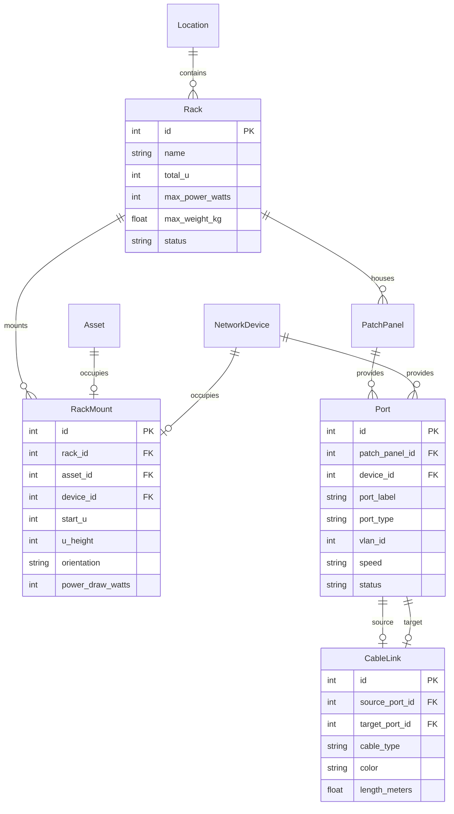

# Design Specification: Interactive Visual Server Rack Designer & Cable Port Mapper

**Date:** 2026-08-18  
**Status:** Approved via `/grill-me` & `/brainstorming`  
**Target Systems:** Backend (`apps/api/core`), Frontend (`apps/web/src/components/locations`, `apps/web/src/app/locations`), Database (`models.py`)

---

## 1. Executive Summary & Zero-Mock Data Policy

Transform the facility and location management module from a static display into a fully interactive **Digital Twin Server Rack Cabinet Designer & Cable Port Mapper**. In accordance with `.agents/AGENTS.md`, all mock data in `RackVisualizer.tsx` is completely eliminated and replaced with real relational database models, live telemetry aggregation, interactive drag-and-drop mounting, and visual port-to-port cable run mapping.

---

## 2. Relational Data Architecture

---

## 3. Core Capabilities & User Experience

### 1. Interactive 42U Rack Elevation Canvas ([`RackVisualizer.tsx`](file:///c:/Users/armut/404/BikitaIT/apps/web/src/components/locations/RackVisualizer.tsx))

- **Live 42U Vertical Grid**: Accurately renders 1U to 42U slots from top to bottom (with reversed U numbering convention: U42 top down to U1 bottom).
- **Chassis Dimensional Rendering**:
  - 1U: Switches, Patch Panels, 1U Pizza-box Servers, Firewalls.
  - 2U: Standard Enterprise Servers (Dell R750, HP DL380, Storage SANs).
  - 3U/4U: Heavy UPS battery backup banks and disk enclosures.
- **Front & Rear Orientation Toggle**: View front faceplates (activity LEDs, drive bays, ports) or rear panels (power supply cords, exhaust fans, management cables).
- **Drag-and-Drop Staging Sidebar**: Drag unallocated `Asset` or `NetworkDevice` items from the unmounted pool directly onto open U-slots with instantaneous collision validation.
- **Power & Capacity Telemetry**:
  - Total rack electrical load calculated from real `power_draw_watts` values.
  - Circuit capacity limit gauge with dynamic visual warnings (Amber $\ge 80\%$, Red Alert $\ge 95\%$).

### 2. High-Density Port Mapper & Cable Tracer ([`PortMatrixVisualizer.tsx`](file:///c:/Users/armut/404/BikitaIT/apps/web/src/components/locations/PortMatrixVisualizer.tsx))

- **Faceplate Grid**: 12/24/48-port RJ45, SFP+ (10G), and Fiber LC arrays.
- **Click-to-Patch Wiring Flow**:
  1. Click starting port on Switch/Panel A.
  2. Click destination port on Patch Panel/Device B.
  3. Select cable type (Cat6A, Single-Mode Fiber, Multi-Mode Fiber, DAC) and color (Blue, Yellow, Orange, Aqua, Purple, Black).
  4. Visual curved bezier wire is rendered with live link status.
- **Printable Cable Runbook**: 1-click export generating a complete Datacenter Patch Schedule PDF / CSV with port numbers, destination tags, cable colors, and lengths.

---

## 4. API Endpoints (`/api/racks`)

| Method | Endpoint | Description |
| :--- | :--- | :--- |
| `GET` | `/api/racks` | List all rack cabinets with live U-occupancy % and power kW load |
| `POST` | `/api/racks` | Create a new rack cabinet inside a location node |
| `GET` | `/api/racks/{id}/elevation` | Retrieve 42U slot allocation map, mounted assets, and telemetry |
| `POST` | `/api/racks/{id}/mount` | Mount an asset or network device into specific U-slots with collision check |
| `DELETE` | `/api/racks/{id}/unmount/{mount_id}` | Unmount hardware and return it to the available pool |
| `GET` | `/api/racks/{id}/ports` | List all patch panels, switch ports, and active cable runs |
| `POST` | `/api/racks/cables/link` | Create a cable link between two ports with cable type and color |
| `DELETE` | `/api/racks/cables/unlink/{link_id}` | Disconnect a cable link |

---

## 5. Verification & Testing Plan

1. **Backend Unit & Integration Tests (`apps/api/core/tests.py`)**:
   - `test_rack_creation_and_elevation_mapping`: Create rack and verify 42U empty slot map.
   - `test_rack_mount_collision_prevention`: Verify mounting overlapping hardware raises HTTP 400.
   - `test_port_cable_linking_and_runbook`: Connect two ports and verify bidirectional link resolution.
   - `test_power_telemetry_aggregation`: Verify total power kW increases with mounted equipment.
2. **Frontend Typecheck & Component Tests**:
   - `tsc --noEmit`: 0 TypeScript errors.
   - Vitest component tests verifying drag-drop mounting and port selection state.
