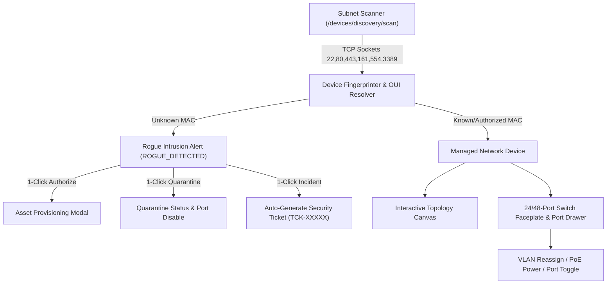

# Design Specification: Network Operations Center (NOC) & Topology Suite

## Overview
The **Network Operations Center (NOC) & Topology Suite** upgrades BikitaIT into an enterprise network management and monitoring platform. It delivers automated CIDR subnet scanning with multi-protocol signature port probing, high-priority rogue device intrusion defense, an interactive visual topology canvas, and physical 24/48-port switch faceplate matrices with real-time port telemetry.

Strictly adhering to the **zero-mock data policy**, all network devices, switch ports, topology links, and scan results are queried from and persisted to the real Django database and live OS network sockets.

---

## 1. Core Capabilities & Workflows

---

## 2. Architectural Components

### 2.1 Backend Network Scanner & Router (`apps/api/core`)

#### Multi-Protocol Port Probing (`apps/api/core/network_scanner.py`)
- **Signature Ports**:
  - `22`: SSH / Managed Switch / Linux Server
  - `80` / `443`: HTTP/HTTPS Web Console
  - `53`: DNS Server / Gateway
  - `161`: SNMP Management Agent
  - `554`: RTSP / IP Surveillance Camera
  - `3389`: Microsoft RDP Server / Workstation
  - `8080`: Management Controller (e.g. UniFi / Omada)
- **OUI Vendor Prefix Resolution**: Expands vendor database with Ubiquiti, Cisco, MikroTik, Dell, HP, Dahua, Hikvision, Synology, Raspberry Pi.
- **Rogue Device Classification**: Compares discovered MAC against registered `NetworkDevice` and `Asset` models. If not recognized, flags status as `ROGUE_DETECTED` and stages for security review.

#### Enhanced Endpoints (`apps/api/core/routers/network.py`)
1. `POST /api/devices/discovery/scan`: Initiates multi-threaded CIDR subnet scan (e.g. `192.168.1.0/24` or custom range).
2. `GET /api/devices/discovery/status`: Streams real-time scan progress, scanned IP count, discovered hosts, and open ports.
3. `POST /api/devices/discovery/rogue/{device_id}/quarantine`: Immediately sets status to `QUARANTINED` and records security audit log.
4. `POST /api/devices/discovery/rogue/{device_id}/incident`: Auto-generates a critical severity security ticket (`Ticket`) assigned to the IT Security Team.
5. `GET /api/devices/switches/{switch_id}/ports`: Returns switch port density matrix (24 or 48 ports) with link speed, VLAN tag, PoE wattage, and connected device MAC/Asset.
6. `POST /api/devices/switches/{switch_id}/ports/{port_number}/configure`: Configures port state (Enabled/Disabled), assigned VLAN, and PoE power limit.
7. `GET /api/devices/topology/graph`: Returns structured nodes and links for hierarchical canvas rendering.

---

### 2.2 Frontend Network Operations Center (`apps/web`)

#### Network Page (`apps/web/src/app/network/page.tsx`)
- **Real-Time Threat & Rogue Alert Banner**: Prominently displays unauthorized devices detected on the LAN with instant actions (`Authorize & Register`, `Quarantine`, `File Security Incident`).
- **Interactive View Modes**:
  1. **Topology Canvas**: Interactive hierarchical diagram (Core Router → Distribution Switches → Access Switches → Endpoints & Cameras) with live pulse indicators and link latency.
  2. **Switch Port-Density Matrix**: Physical 24/48-port switch faceplate rendering with dual-row RJ45 jacks, LED activity lights (Green = 1G, Amber = 100M, Blue = PoE, Gray = Down), and a slide-out Port Detail Drawer.
  3. **Device Inventory & Staging Table**: Searchable, filterable roster with vendor badges, IP/MAC details, open ports, and export actions.

---

## 3. Data Models & Schemas

### 3.1 NetworkDevice Extensions (`apps/api/core/models.py`)
- `port_count`: `IntegerField(default=24)` (for switches/routers).
- `port_configurations`: `JSONField(default=dict)` (stores per-port status: `{ "1": { "status": "UP", "speed": "1000M", "vlan": 10, "poe_watts": 12.4, "connected_mac": "00:1A:A0:12:34:56", "enabled": true } }`).
- `is_rogue`: `BooleanField(default=False, db_index=True)`.
- `last_scanned_ports`: `JSONField(default=list)` (open signature ports).

---

## 4. Verification Plan

### Automated Backend Tests (`apps/api/core/tests.py`)
- **`NetworkOperationsCenterSuiteTests`**:
  - Test subnet scan initiation and status streaming.
  - Test multi-port socket probe fingerprinting.
  - Test rogue device detection, quarantining, and auto-incident ticket creation.
  - Test switch port matrix query and port configuration mutation.

### Frontend Verification
- `npm --prefix apps/web run typecheck` (`tsc --noEmit`) clean with 0 errors.
- `npm --prefix apps/web test -- --run` all tests passing.
